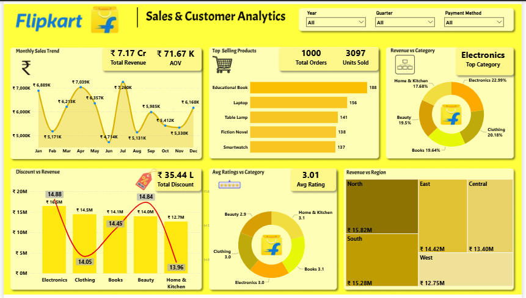

# 📊 Flipkart Sales & Customer Analytics Dashboard

> **An interactive Power BI dashboard designed to transform e-commerce sales data into actionable business insights.**


---

## 📌 Project Overview

The **Flipkart Sales & Customer Analytics Dashboard** is an interactive Business Intelligence solution developed using **Microsoft Power BI**.

The objective of this project was not simply to visualize sales data, but to answer important business questions such as:

* How is revenue changing over time?
* Which products and categories generate the most revenue?
* Which regions contribute the most to overall sales?
* How do discounts relate to revenue?
* Which products are selling the most units?
* How do customer ratings vary across categories?
* What happens to business performance when a particular product or month is selected?

The dashboard converts raw e-commerce data into an interactive analytical tool that can support **data-driven decision making**.

---

## 🎯 Business Objectives

The dashboard was designed to help answer the following questions:

1. What is the overall sales performance?
2. Which product categories generate the highest revenue?
3. Which products have the highest sales volume?
4. Which regions contribute the most revenue?
5. How does revenue change month by month?
6. What is the relationship between discounts and revenue?
7. How are customer ratings distributed across categories?
8. What are the key performance indicators for a selected product?
9. How does performance change for a selected month?
10. Can the dashboard provide dynamic business insights based on user selections?

---

# 📈 Key Performance Indicators

The dashboard provides the following high-level KPIs:

| KPI                    |    Value |
| ---------------------- | -------: |
| 💰 Total Revenue       | ₹7.17 Cr |
| 🛒 Total Orders        |    1,000 |
| 📦 Units Sold          |    3,097 |
| 💳 Average Order Value |  ₹71.67K |
| 🏷️ Total Discount     |  ₹35.44L |

> **Note:** KPI values represent the current dataset/dashboard view and may change when filters are applied.

---

# 📊 Dashboard Features

## 1. Monthly Sales Trend

Analyzes revenue and sales performance across different months.

### Business Questions

* Which months generated the highest revenue?
* Are there noticeable sales fluctuations?
* Are there potential seasonal patterns?
* Which months require further investigation?

---

## 2. Top-Selling Products

Identifies products based on sales volume.

### Key Finding

**Educational Books** emerged as the top-selling product by units, with **188 units sold** in the analyzed dataset.

---

## 3. Revenue by Product Category

Provides a category-level breakdown of revenue.

### Key Finding

**Electronics** was the leading revenue-generating category, contributing approximately **23% of category revenue** in the analyzed view.

---

## 4. Revenue by Region

Analyzes geographical sales performance across different regions.

### Key Finding

The **North region** generated the highest regional revenue in the current dashboard view, at approximately **₹15.82M**.

---

## 5. Discount vs Revenue Analysis

This analysis explores how discounts and revenue behave relative to each other.

The objective is to help understand whether higher discounting is associated with stronger revenue performance and identify areas that may require deeper business investigation.

> Correlation should not automatically be interpreted as causation. Discount effectiveness should ideally be evaluated using additional variables such as profit margin, product category, order volume, and customer behavior.

---

## 6. Category-Wise Rating Analysis

Analyzes customer ratings across product categories.

This helps identify:

* Categories with stronger customer satisfaction
* Categories requiring attention
* Potential relationships between product performance and customer feedback

---

# 🧠 Dynamic Business Insights

One of the main features of this dashboard is **dynamic storytelling**.

Instead of displaying only static charts, the dashboard generates contextual insights based on user selections.

### 🔎 Product-Level Insights

When a user selects a product, the dashboard dynamically provides information such as:

* Product Revenue
* Total Orders
* Units Sold
* Product Category
* Regional Revenue Performance

This allows users to move from an overall business view to a specific product-level analysis.

---

### 📅 Monthly Performance Insights

When a month is selected, the dashboard dynamically displays:

* Monthly Revenue
* Total Orders
* Units Sold
* Average Order Value
* Top Category
* Top-Performing Region

This transforms the dashboard from a traditional report into an **interactive analytical storytelling tool**.

---

# 🛠️ Tools & Technologies

## Microsoft Power BI

Used for:

* Data modeling
* Interactive visualizations
* KPI development
* Dashboard design
* Business intelligence reporting

## Power Query

Used for:

* Data cleaning
* Data transformation
* Handling data types
* Preparing analytical tables
* Creating a reliable dataset for modeling

## DAX

Used for:

* KPI calculations
* Measures
* Dynamic insights
* Conditional business logic
* Filter-aware calculations
* Analytical metrics

## Data Modeling

Used to create a structured analytical model that supports:

* Relationships
* Filter propagation
* Measure calculations
* Interactive analysis

---

# 📐 Analytical Approach

The project followed a structured data analytics workflow:

```text
Raw E-Commerce Data
        ↓
Data Cleaning
        ↓
Data Transformation
        ↓
Data Exploration
        ↓
Data Modeling
        ↓
DAX Measures
        ↓
KPI Development
        ↓
Data Visualization
        ↓
Interactive Dashboard
        ↓
Business Insights
```

---

# 📊 Dashboard Analysis

The dashboard focuses on multiple dimensions of business performance:

| Analysis Area        | Purpose                                  |
| -------------------- | ---------------------------------------- |
| Revenue Analysis     | Understand overall financial performance |
| Sales Trend Analysis | Identify monthly patterns                |
| Product Analysis     | Identify high-performing products        |
| Category Analysis    | Compare product categories               |
| Regional Analysis    | Identify high-performing regions         |
| Discount Analysis    | Evaluate discount and revenue behavior   |
| Rating Analysis      | Understand customer satisfaction         |
| KPI Analysis         | Monitor overall performance              |
| Dynamic Insights     | Provide contextual business information  |

---

# 🎛️ Interactive Filters

The dashboard provides interactive filtering capabilities, including:

* **Year**
* **Quarter**
* **Payment Method**
* **Product**
* **Month**

These filters allow users to explore the data from different perspectives without creating separate reports for every scenario.

---

# 💡 Key Business Insights

Based on the analyzed dashboard:

### 1. Electronics is a major revenue contributor

Electronics contributes approximately **23% of category revenue**, making it one of the most important categories in the dataset.

### 2. North region shows strong revenue performance

The North region generated approximately **₹15.82M** in revenue in the current dashboard view.

### 3. Educational Books lead in units sold

Educational Books recorded **188 units sold**, making it the top-selling product by volume.

### 4. Sales performance fluctuates over time

The monthly sales trend shows noticeable fluctuations, suggesting potential opportunities to investigate:

* Seasonality
* Demand changes
* Promotional campaigns
* Product availability
* Customer purchasing patterns

### 5. Discounts require deeper analysis

Discounts should not be evaluated only by looking at revenue.

A complete business analysis would also consider:

```text
Discount
   ↓
Sales Volume
   ↓
Revenue
   ↓
Gross Margin
   ↓
Profitability
```

This would provide a better understanding of whether discounting actually creates profitable growth.

---

# 🎨 Dashboard Design Principles

While designing the dashboard, the focus was on:

* Clean visual hierarchy
* Business-focused KPIs
* Interactive filtering
* Minimal visual clutter
* Easy comparison
* Contextual insights
* Consistent formatting
* Decision-oriented storytelling

The goal was to ensure that users could quickly move from:

**"What happened?" → "Why might it have happened?" → "Where should we investigate?"**

---

# 📷 Dashboard Preview

> Add your dashboard screenshot here.

```markdown

```

### Recommended Repository Structure

```text
Flipkart-Sales-PowerBI/
│
├── 📁 Dataset/
│   └── flipkart_sales.csv
│
├── 📁 Dashboard/
│   └── Flipkart_Sales_Analytics.pbix
│
├── 📁 Images/
│   └── dashboard.png
│
├── 📁 Documentation/
│   └── data_dictionary.md
│
└── README.md
```

---

# 🔍 Example Business Questions

This dashboard can be used by a business analyst or management team to investigate questions such as:

### Sales

* What is our total revenue?
* Which months perform best?
* Are sales increasing or decreasing?

### Products

* Which products sell the most?
* Which products generate the most revenue?
* Which categories need attention?

### Regions

* Which region contributes the most revenue?
* Which regions have weaker performance?

### Customers

* Which categories receive better ratings?
* Are high-selling products also highly rated?

### Promotions

* Are higher discounts associated with higher revenue?
* Which products receive the largest discounts?
* Does discounting appear to increase sales volume?

---

# 🚀 Future Improvements

Possible improvements for the next version include:

* [ ] Profit & Profit Margin Analysis
* [ ] Customer Segmentation
* [ ] Customer Lifetime Value
* [ ] Repeat Customer Analysis
* [ ] Product Profitability Analysis
* [ ] Discount Effectiveness Analysis
* [ ] Year-over-Year Growth
* [ ] Month-over-Month Growth
* [ ] Sales Forecasting
* [ ] Advanced Drill-Through Pages
* [ ] Decomposition Tree Analysis
* [ ] What-If Discount Analysis
* [ ] RFM Customer Segmentation

---

# 📚 Learning Outcomes

This project helped strengthen my understanding of:

* Power BI
* Power Query
* DAX
* Data Modeling
* Data Cleaning
* KPI Development
* Data Visualization
* Business Analytics
* Interactive Dashboard Design
* Data Storytelling
* Translating business questions into analytical solutions

More importantly, the project reinforced an important principle:

> **Good data analytics is not about adding more visuals. It is about asking the right business questions and presenting the answers clearly.**

---

# 👨‍💻 About the Project

This project was created as part of my continuous learning journey in:

**Power BI | Data Analytics | Business Intelligence | SQL | Python | Data Visualization**

I am continuously building projects that focus on converting raw data into meaningful business insights.

---

# 🔗 Connect With Me

**LinkedIn:** [Mohammad Islam Khan](https://www.linkedin.com/in/mohammad-islam-khan-22esbcs301/)

---

# ⭐ Support

If you find this project useful or interesting, consider giving the repository a ⭐.

Feedback and suggestions are always welcome!

---
